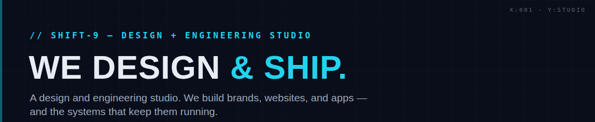
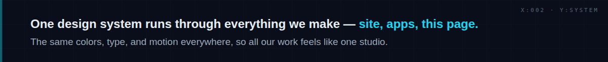
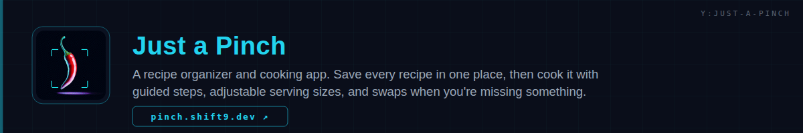
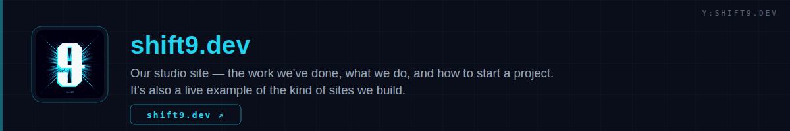
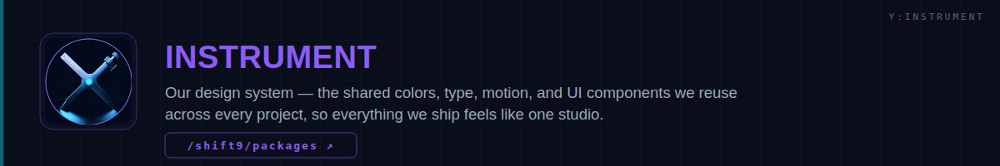
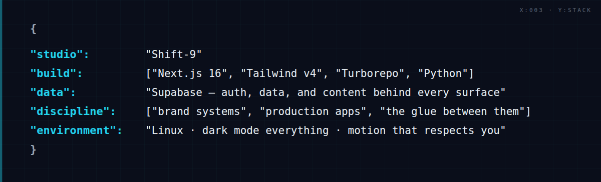
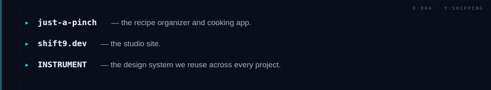
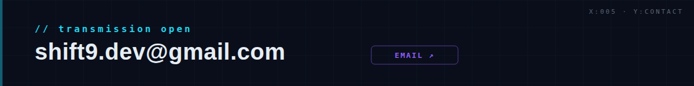
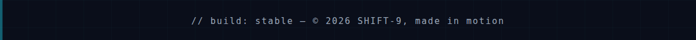

<!-- ░░░░░░░░░░░░░░░░░░░░  HERO  ░░░░░░░░░░░░░░░░░░░░ -->

<!-- ░░░░░░░░░░░░░░░░░░░░  NAV  ░░░░░░░░░░░░░░░░░░░░ -->

&nbsp;
&nbsp;
&nbsp;
&nbsp;

<!-- ░░░░░░░░░░░░░░░░░░░░  INTRO  ░░░░░░░░░░░░░░░░░░░░ -->

> **Shift-9 is a design + engineering studio.** We build brands, websites, and apps — and the systems that keep them running. One design system (**INSTRUMENT**) runs through everything we ship, so the studio site, our products, and even this page all feel like one studio.

&nbsp;

&nbsp;

## What We Build

One design system runs through everything — the studio site, the apps, and this page.

### Open Source

Public projects — games, tooling, and studio R&D.

| Project | What it is | Stack |
| :-- | :-- | :-- |
| **Midnight Return** | A Metroidvania platformer with hand-built movement and combat | `C#` |
| **Omni-3D** | A modular toolkit for building 3D games | `TypeScript` |
| **Sub Scraper** | Download your entire Spotify & SoundCloud library in one command | `Python` |
| **whome Diagnostic** | A utility that fixes the Windows 10 Home upgrade bug | `Python` |

### In the Workshop

Internal projects in progress.

| Project | What it is | Stack |
| :-- | :-- | :-- |
| **Voxel Arcade Basketball** | A 3D voxel basketball arcade game, targeting a Steam release | `Python` |
| **Recipe Engine** | The data pipeline that seeds structured recipes into Supabase at scale, powering Just a Pinch | `Python` · `Supabase` |
| **Signal Grid** | Shift-9's brand identity and design-token system, unified across every surface | `Tokens` · `CSS` |
| **Dither Lab** | WebGL R&D for dithering techniques and GLSL shaders — origin of the animated backgrounds | `WebGL` · `GLSL` |

## The Stack

## Work With Us

Have a project? We take on **brand systems, production web apps, and the infrastructure behind them** — from a single landing page to a full design system shared across products. We design *and* ship, so one team carries it from first pixel to deploy.

&nbsp;

## Currently Shipping

## Contact

