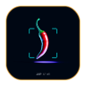

<p align="center">
  
</p>

<p align="center">
  <a href="https://shift9.dev"></a>&nbsp;
  &nbsp;
  
</p>

> **We design and ship.** Brands, products, and the systems that run them —
> clean, optimized, and impossible to ignore. No filler, no fluff.

<p align="center">
  
</p>


We run one design system across every surface — **one theme, three faces.** Edit a
token once, and the studio site, the product, and this very page all move together.

<table>
  <tr>
    <td width="120" align="center">
      <br>
    </td>
    <td>
      <strong><a href="https://shift9.dev">Just a Pinch</a></strong><br>
      A smart recipe organizer &amp; cooking app. Keep every recipe you love in one place, then get guided, step-by-step cooking — scaled to your servings, with smart swaps when you're missing an ingredient.
    </td>
  </tr>
  <tr>
    <td width="120" align="center">
      <br>
    </td>
    <td>
      <strong><a href="https://shift9.dev">shift9.dev</a></strong><br>
      The flagship studio site. Cyber-brutalist, kinetic, and engineered down to the dither — a live demo of how we build.
    </td>
  </tr>
  <tr>
    <td width="120" align="center">
      <br>
    </td>
    <td>
      <strong><a href="https://github.com/shift9-studio/.github/tree/main/shift9/packages">The INSTRUMENT design system</a></strong><br>
      Our in-house design system — the tokens, motion springs, and signature components every Shift-9 surface inherits. One theme, three faces.
    </td>
  </tr>
</table>


```jsonc
{
  "studio":      "Shift-9",
  "build":       ["Next.js 16", "Tailwind v4", "Turborepo", "Python"],
  "data":        "Supabase — auth, data, and content behind every surface",
  "discipline":  ["brand systems", "production apps", "the glue between them"],
  "environment": "Linux · dark mode everything · motion that respects you"
}
```


- **`just-a-pinch`** — a smart recipe organizer + cooking app: save what you love, then actually cook it.
- **`shift9.dev`** — the studio site, live and kinetic.
- **the design system** — tokens, springs, and the dither field, packaged and reused.

---

<p align="center">
  <a href="mailto:shift9.dev@gmail.com"></a>
</p>

<p align="center"><sub><code>// build: stable — © 2026 SHIFT-9, made in motion</code></sub></p>
