
<a href="https://shift9.dev"></a>
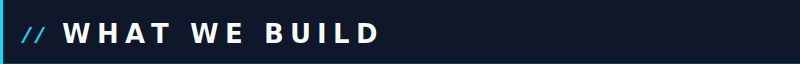
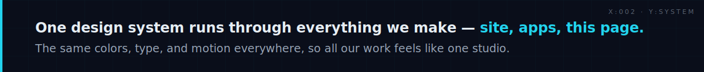
<a href="https://shift9.dev">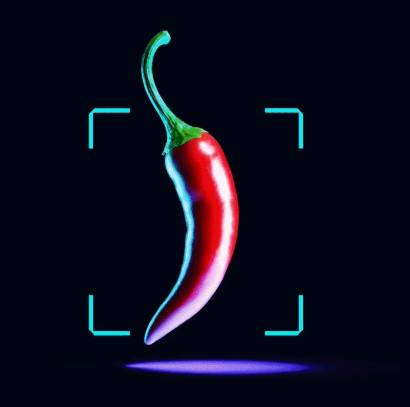</a>
<a href="https://shift9.dev"></a>
<a href="https://github.com/shift9-studio/.github/tree/main/shift9/packages"></a>
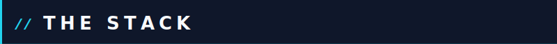
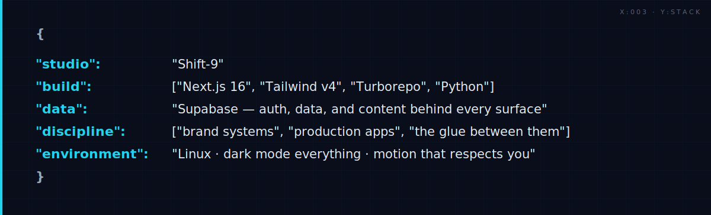
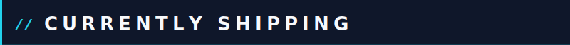
<a href="mailto:shift9.dev@gmail.com"></a>
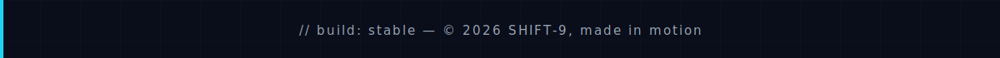
