

<a href="https://github.com/Kariimc/Midnight-return-"></a>
<a href="https://github.com/Kariimc/Omni-3d"></a>
<a href="https://github.com/Kariimc/Sub-Scraper"></a>
<a href="https://github.com/Kariimc/whome-diagnostic-tool"></a>
<a href="https://github.com/Kariimc/Bball"></a>

