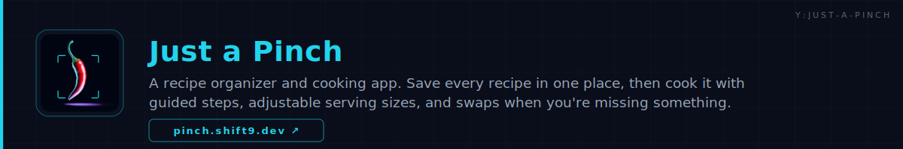
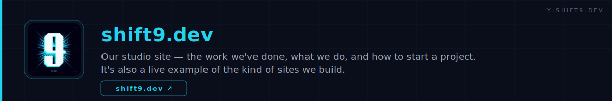
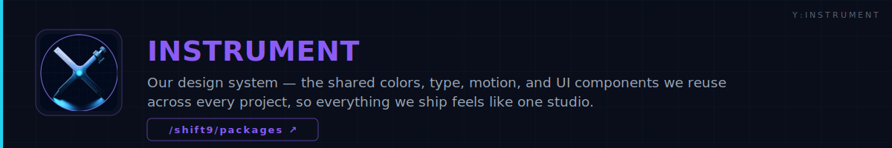

<!-- ░░░░░░░░░░░░░░░░░░░░  HERO  ░░░░░░░░░░░░░░░░░░░░ -->

<!-- ░░░░░░░░░░░░░░░░░░░░  INTRO  ░░░░░░░░░░░░░░░░░░░░ -->

&nbsp;

&nbsp;

## // What We Build

One design system runs through everything — the studio site, the apps, and this page.

### // Also in the lab

Open-source projects and studio R&D — live on GitHub.

Internal · shipping soon

## // The Stack

## // Currently Shipping

## // Contact

