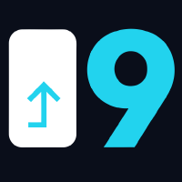

  

  <h1>Shift-9 Studios</h1>

  
<strong>Design + engineering for web, mobile, automation, and real-time 3D.</strong>

  
We take products from the first idea through shipped software, including the design systems and production tooling behind them.

  

    
    
    
  

## Core stack

The tools are upfront because the implementation matters as much as the screenshots. Every technology below is tied to shipped work or an active production system.

  
  
  
  
  
  
  

| Lane | Production evidence |
| :-- | :-- |
| Web + product interfaces | TypeScript, React, React Native, and Next.js across Shift-9, Feelspoon, and Titanium Forge Pro |
| Systems + automation | Node.js and Python across the studio control plane, Flow State, and Bring Up Desk |
| Data + backend | Supabase behind the Feelspoon Recipe Engine |
| Real-time 3D | Godot and GDScript for Voxel Arcade Basketball |

## Selected work

| Product | What it does |
| :-- | :-- |
| **[Feelspoon](https://feelspoon.app)** LIVE · React Native · TypeScript · Supabase | Smart recipe organizer and guided cooking app. Save from links, photos, or scratch, then cook with scaled servings and substitutions. |
| **[Flow State](https://shift9.dev/flow-state)** SHIPPING · Python · Whisper · Windows | Local-first voice-to-text dictation for Windows with profiles, custom vocabulary, selected-text commands, history, and crash recovery. |
| **[shift9.dev](https://shift9.dev)** LIVE · Next.js · React · TypeScript | The studio portfolio and an interactive example of the web experiences we design and build. |
| **[INSTRUMENT](https://shift9.dev/instrument)** LIVE · Design systems · Motion · Accessibility | The shared interaction, motion, and accessibility system used across Shift-9 products. |

## Studio systems

- **Automation Systems**: the local production control plane for specialist routing, decision gates, searchable project memory, and code and visual proof.
- **Bring Up Desk**: a human-gated production system for researched hardware and AI explainers, from primary sources through private-draft upload.
- **Titanium Forge Pro**: a portable React component workbench with live demos and copyable production snippets.
- **Game Design Forge**: Unreal Engine R&D for assembling game systems through matched, reusable parts.

## Work with Shift-9

We design and build product websites, production apps, automation systems, and interactive 3D experiences. One studio carries the work from product direction and interface design through engineering and release.

  

## Connect

  
  
  
  
  
  

© 2026 Shift-9 Studios. Work in progress is labeled plainly.

